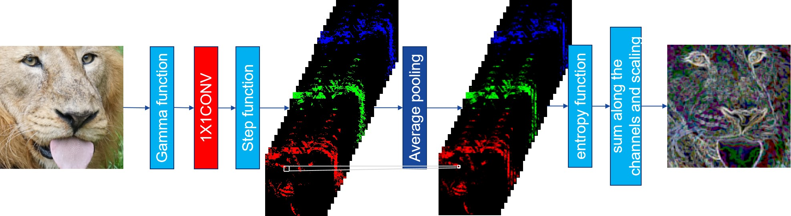

# regional-differential-information-entropy-for-SR-image-quality-assessment
区域差分信息熵，一个用于评价超分辨率图像感知质量的评价指标。

The implementation of paper [**Regional Differential Information Entropy for Super-Resolution Image Quality Assessment**](https://github.com/AlbertXu233/RDIE-for-SR-IQA/edit/main/README.md). Under our assessment, the smaller the value, the better the perceptual quality.

## Requirement
```
opencv-python
numpy>=1.20.1
tensorflow>=2.3.0
keras>=2.4.3
```
## How to Run
Prepare paired images and call our method in *RDIE.py*. 
You can run *demo.py* for a try.
